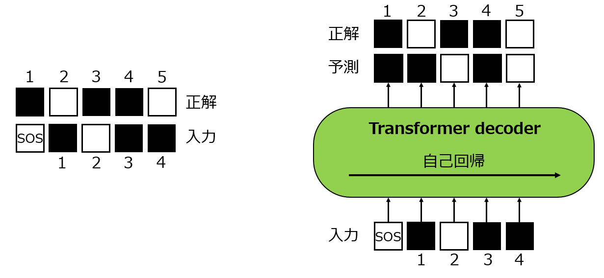
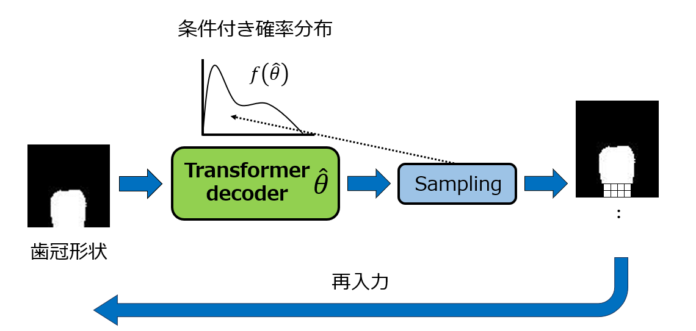

# 自己回帰型生成モデル

卒業論文**自己回帰型生成モデルを用いた前額面歯冠形状に基づく歯根形状予測**で使用したソースコードです．





## 実行環境

Ubuntu 22.04.3 LTS  
GPU NVIDIA RTX 3060  
GPU Memory 12GB  
pytorch_lightning 1.9  

```copy
pip install pytorch_lightning==1.9
```
